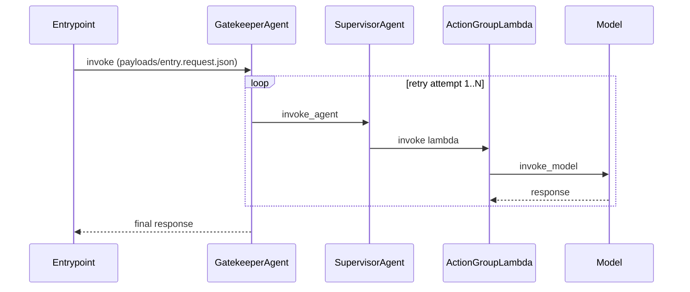

# Sequence diagrams

ITK generates multiple sequence diagram formats:

| Format | File | Description |
|--------|------|-------------|
| **Trace Viewer** | `trace-viewer.html` | Interactive SVG with pan/zoom, search, details panel |
| **Mermaid** | `sequence.mmd` | Portable text format for GitHub, VS Code |
| **HTML Mermaid** | `sequence.html` | Legacy rendered Mermaid diagram |

---

## Trace Viewer (trace-viewer.html)

The primary visualization. Features:

- **Entry/exit indicators**: Horizontal arrows on the left of the first lifeline
  - `▶ operation_name` — Entry arrow pointing INTO the lifeline
  - `◀ latency ✅/❌` — Exit arrow pointing OUT from the lifeline with status
- **Call/return arrows**: Between participants
  - Solid arrow `→` for request/call
  - Dashed arrow `←` for response/return
- **Retry badges**: `🔄 retry N` positioned on the left margin
  - Shows retry number (attempt 2 → "retry 1", attempt 3 → "retry 2")
- **Status indicators**: ✅ success / ❌ error on return arrows
- **Activation boxes**: Vertical bar showing span duration on callee lifeline

### Visual Layout

```
     ┌──────────────┐    ┌──────────────┐    ┌──────────────┐
     │  entrypoint  │    │    agent     │    │   lambda     │
     └──────┬───────┘    └──────┬───────┘    └──────┬───────┘
            │                   │                   │
  ▶ invoke  │                   │                   │  ← Entry arrow
            │──────────────────►│                   │  ← Call arrow
            │                   │──────────────────►│
            │                   │◄ - - - - - - - - -│✅ ← Return arrow with status
            │◄ - - - - - - - - -│✅                 │
  ◀ 150ms ✅│                   │                   │  ← Exit arrow
            │                   │                   │
```

### Retry Visualization

```
            │                   │                   │
            │──────────────────►│                   │  attempt 1
            │◄ - - - - - - - - -│❌                 │  failure
🔄 retry 1  │──────────────────►│                   │  attempt 2
            │◄ - - - - - - - - -│✅                 │  success
            │                   │                   │
```

---

## Mermaid Format (sequence.mmd)

Portable text output for GitHub PRs, VS Code preview, and documentation.

The diagram shows:
- participants (agents/lambdas/models/tools)
- each request/response hop
- retries as `loop` blocks
- notes that link to full JSON payload artifacts

Example:


