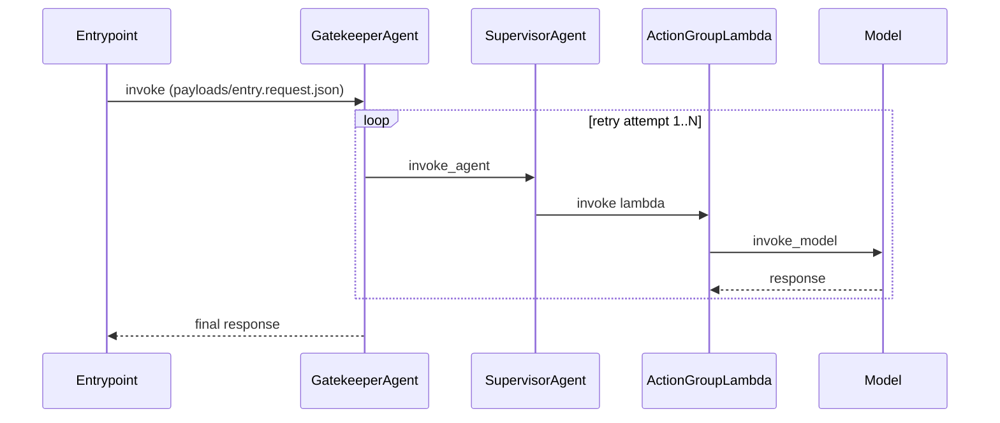

# Sequence diagrams

Output is Mermaid so it can live as a normal `.mmd` file and render on GitHub.

The diagram must show:
- participants (agents/lambdas/models/tools)
- each request/response hop
- retries as `loop` blocks
- notes that link to full JSON payload artifacts

Example:

