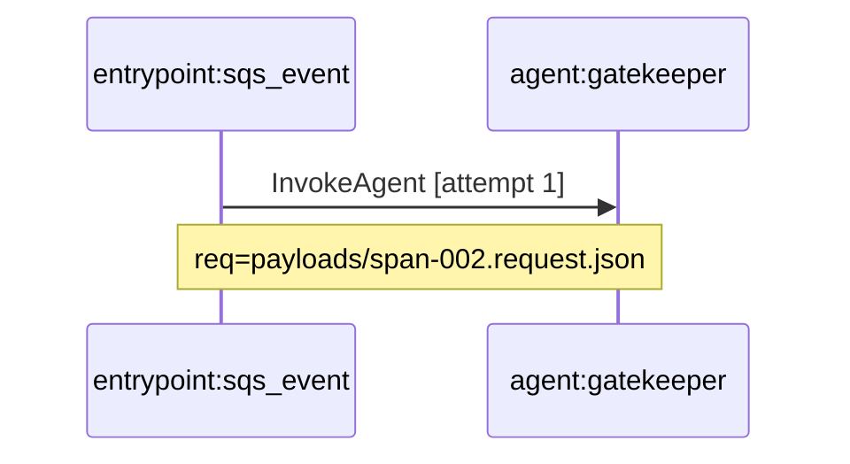

# ITK Report Structure

This document describes the structure of test report artifacts generated by ITK.

## Report Artifacts Overview

When you run `itk run --case <path> --out <dir>`, the following artifacts are generated:

```
<out-dir>/
├── trace-viewer.html    ← Interactive sequence diagram viewer
├── timeline.html        ← Waterfall timeline visualization  
├── sequence.html        ← Legacy Mermaid-rendered diagram
├── sequence.mmd         ← Mermaid diagram source
├── report.md            ← Markdown summary with invariant results
├── spans.jsonl          ← Raw span data (one JSON object per line)
├── thumbnail.svg        ← Mini preview of sequence flow
├── timeline-thumbnail.svg
└── payloads/
    ├── span-001.request.json
    ├── span-001.response.json
    ├── span-002.request.json
    └── ...
```

---

## trace-viewer.html — Interactive Sequence Diagram

**Primary visualization for exploring trace data.**

### Layout

```
┌──────────────────────────────────────────────────────────────────────────────┐
│  Trace Viewer — <case-id>              [🔍 Search] [🔴 Errors] [🔄 Retries] 🌙 │
├──────────────────────────────────────────────────────────────┬───────────────┤
│                                                              │ Span Details  │
│                   SVG Sequence Diagram                       │               │
│                                                              │ Operation:    │
│  ┌─────────┐      ┌─────────┐      ┌─────────┐              │ Component:    │
│  │ entrypoint │    │  agent   │    │  lambda  │              │ Span ID:      │
│  └────┬────┘      └────┬────┘      └────┬────┘              │ Latency:      │
│       │                │                │                    │ Status: ✅    │
│       │──────────────► │                │                    │               │
│       │◄ - - - - - - - │                │                    │ Request:      │
│       │                │──────────────► │                    │ { ... }       │
│       │                │◄ - - - - - - - │                    │               │
│                                                              │ Response:     │
│  [+] [-] [⊡] [↺]    Keyboard: / search  Esc clear  ↑↓ nav   │ { ... }       │
├──────────────────────────────────────────────────────────────┴───────────────┤
│  Spans: 3  │  Participants: 3  │  Errors: 0  │  Retries: 0                   │
└──────────────────────────────────────────────────────────────────────────────┘
```

### Features

| Feature | Description |
|---------|-------------|
| **Pan & Zoom** | Mouse wheel to zoom, drag to pan. Buttons: +, -, fit, reset |
| **Search** | Press `/` to focus. Fuzzy search by operation, component, span ID |
| **Filters** | 🔴 Errors — show only error spans. 🔄 Retries — show only retries |
| **Click Span** | Opens details panel on right with full request/response JSON |
| **Copy Payload** | Click 📋 button to copy JSON to clipboard |
| **Keyboard Nav** | `↑`/`↓` to navigate spans, `Esc` to clear selection |
| **Dark Mode** | Click 🌙 to toggle dark theme |

### Sequence Diagram Elements

| Element | Meaning |
|---------|---------|
| **Solid arrow →** | Call (request sent) |
| **Dashed arrow ←** | Return (response received) |
| **Green ✅** | Successful span |
| **Red ❌** | Error span |
| **Yellow badge** | Retry attempt (attempt > 1) |
| **Activation box** | Duration of span on callee's lifeline |

---

## timeline.html — Waterfall Timeline

**Shows spans as horizontal bars on a time axis.**

### Layout

```
┌─────────────────────────────────────────────────────────────────────────┐
│  Timeline — <case-id>                                     [Export] 🌙   │
├─────────────────────────────────────────────────────────────────────────┤
│                                                                         │
│  Component          0ms     100ms    200ms    300ms    400ms    500ms   │
│  ─────────────────────────────────────────────────────────────────────  │
│  entrypoint:sqs     ██████████████████████████████████████████████████  │
│  agent:gatekeeper          ████████████████████████████████             │
│  lambda:action                      ██████████████                      │
│                                                                         │
├─────────────────────────────────────────────────────────────────────────┤
│  Selected: span-002  │  Duration: 150ms  │  Status: Success             │
└─────────────────────────────────────────────────────────────────────────┘
```

### Features

- **Proportional bars**: Width proportional to span duration
- **Color coding**: Each component type has a distinct color
- **Critical path**: Longest path highlighted in yellow outline
- **Hover details**: Duration and status on hover
- **Dark mode**: Click 🌙 to toggle

---

## report.md — Markdown Summary

**Human-readable summary for quick review.**

### Contents

```markdown
# ITK Run Report

## Case
- **ID**: example-001
- **Name**: Example SQS-shaped entrypoint
- **Entrypoint**: sqs_event

## Summary
- **Spans**: 3
- **Components**: 3

## Invariants
- ✅ PASS `has_spans` (count: 3)
- ✅ PASS `no_duplicate_span_ids`
- ✅ PASS `has_entrypoint` (root_count: 1)
- ✅ PASS `no_orphan_spans`
- ✅ PASS `valid_timestamps`
- ✅ PASS `max_retry_count` (max_allowed: 5)

## Spans
| Span ID | Component | Operation | Has Request | Has Response |
|---------|-----------|-----------|-------------|--------------|
| span-001 | entrypoint:sqs_event | InvokeLambda | ✅ | ✅ |
| ... | ... | ... | ... | ... |
```

---

## sequence.mmd — Mermaid Source

**Portable diagram source for embedding in docs/PRs.**



Can be rendered in:
- GitHub PR descriptions and comments
- VS Code Markdown preview (with Mermaid extension)
- Any Mermaid-compatible tool

---

## payloads/ — Request/Response JSON

**Individual JSON files for each span's request and response.**

```
payloads/
├── span-001.request.json    ← Request payload for span-001
├── span-001.response.json   ← Response payload for span-001
├── span-002.request.json
├── span-002.response.json
├── span-003.error.json      ← Error payload (if span errored)
└── ...
```

**Why separate files?**
- Large payloads don't bloat the main report
- Easy to diff between runs
- Can be committed to version control for baseline comparison

---

## Suite Report (index.html)

When running `itk suite --cases-dir <dir> --out <dir>`, generates:

```
<out-dir>/
├── index.html          ← Suite summary with all cases
├── index.json          ← Machine-readable summary
├── case-001/
│   ├── trace-viewer.html
│   └── ...
├── case-002/
│   └── ...
└── ...
```

### index.html Layout

```
┌─────────────────────────────────────────────────────────────────────────┐
│  ITK Suite Report                                     Run: 2026-01-15   │
├─────────────────────────────────────────────────────────────────────────┤
│                                                                         │
│  Summary: 10 passed, 2 failed, 12 total                                 │
│                                                                         │
│  Case         Status    Duration   Spans   Errors   Preview            │
│  ─────────────────────────────────────────────────────────────────────  │
│  example-001  ✅ PASS   1.2s       3       0        [mini-diagram]      │
│  example-002  ✅ PASS   0.8s       2       0        [mini-diagram]      │
│  example-003  ❌ FAIL   2.1s       5       1        [mini-diagram]      │
│                                                                         │
└─────────────────────────────────────────────────────────────────────────┘
```

Click any row to open the full `trace-viewer.html` for that case.

---

## Opening Reports

All reports work via `file://` protocol — no server required.

```bash
# Windows
start artifacts/demo-run/trace-viewer.html

# macOS
open artifacts/demo-run/trace-viewer.html

# Linux
xdg-open artifacts/demo-run/trace-viewer.html
```

Or use the ITK serve command for live preview:
```bash
itk serve --dir artifacts/demo-run --port 8080
```
