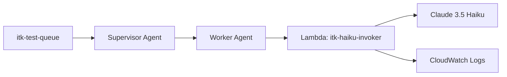

# ITK Terraform Infrastructure

This Terraform configuration creates the full ITK test environment:

```
SQS Queue → Supervisor Agent → Worker Agent → Lambda → Claude 3.5 Haiku
```

## Architecture



## Prerequisites

1. AWS CLI configured with MFA profile:
   ```powershell
   cd ..\
   .\mfa-auth.ps1 -Code XXXXXX
   ```

2. Terraform installed:
   ```powershell
   winget install HashiCorp.Terraform
   ```

## Usage

### First-time setup

```powershell
# Set AWS profile
$env:AWS_PROFILE = "itk-mfa"

# Initialize Terraform
terraform init

# Preview changes
terraform plan

# Apply (creates all resources)
terraform apply
```

### Generate .env.live

After applying, create the environment file:

```powershell
terraform output -raw env_file_content | Out-File -FilePath ..\..\..\.env.live -Encoding utf8
```

### Destroy everything

```powershell
terraform destroy
```

## Resources Created

| Resource | Name | Purpose |
|----------|------|---------|
| IAM Role | itk-lambda-role | Lambda execution + Bedrock invoke |
| IAM Role | itk-bedrock-agent-role | Bedrock agent permissions |
| Lambda | itk-haiku-invoker | Invokes Claude 3.5 Haiku |
| Log Group | /aws/lambda/itk-haiku-invoker | Lambda logs (7 day retention) |
| SQS Queue | itk-test-queue | Test message queue |
| SQS Queue | itk-test-queue-dlq | Dead letter queue |
| Bedrock Agent | itk-supervisor | Coordinates work |
| Bedrock Agent | itk-worker | Calls Lambda action group |

## Outputs

After apply, get specific values:

```powershell
terraform output lambda_function_name
terraform output sqs_queue_url
terraform output supervisor_agent_id
```

## Cost

All resources are pay-per-use with no fixed costs:
- Lambda: Free tier covers 1M requests/month
- SQS: Free tier covers 1M requests/month
- Bedrock Agents: Pay per invocation
- Claude 3.5 Haiku: ~$0.25/1M input tokens, $1.25/1M output tokens
- CloudWatch Logs: $0.50/GB ingested

For testing, expect < $1/month.
